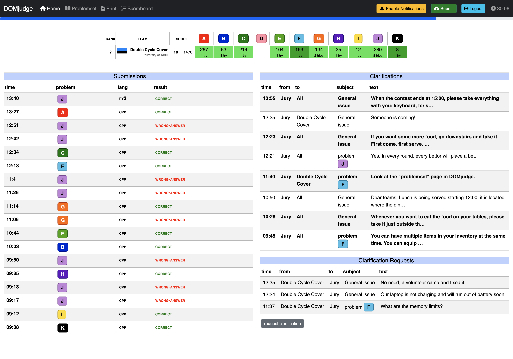
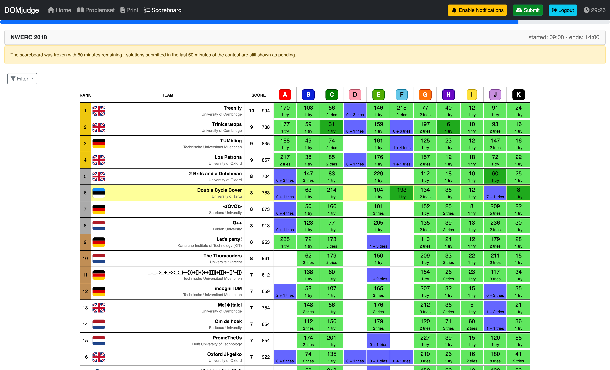

DOMjudge team manual
====================

.. footer::

   |DOMjudge| team manual version |version| - page ###Page### / ###Total###


.. image:: ../logos/DOMjudgelogo.*
   :width: 60pt
   :height: 132pt
   :alt: DOMjudge logo
   :align: right

This is the manual for the DOMjudge programming contest control system
version |version|.
The summary below outlines the working of the system interface. It
is meant as a quick introduction, to be able to start using the system.
It is however strongly advised that your team reads the entire document.
There are specific details of this contest control system that might
become of importance when you run into problems.

.. admonition:: Summary

   DOMjudge works through a web interface that can be found at
   |baseurlteam|. See the two figures on the next page for
   an impression.

   Solutions have to read all input from 'standard in' and write all
   output to 'standard out' (also known as console). You will never have
   to open (other) files. Also see our :ref:`code examples <codeexamples>`.

   You can submit solutions in two ways:

   Command-line
     Use ``submit <filename>``. If your filename is of the form
     ``<problem>.<extension>`` where ``<problem>`` is the
     label of the problem and ``<extension>`` is a standard extension for
     your language, then these will automatically be detected.
     It will also try to auto-detect the main class (for Java and Kotlin) or the
     main file (for Python). You can override these auto-detections;
     for a complete reference of all options and examples, see ``submit --help``.

   Web interface
     From your team page, |baseurlteam|, click the green **Submit**
     button in the menu bar. Select the files you want to submit.
     By default, the problem is selected from the base of the (first)
     filename and the language from the extension. The web interface tries
     to auto-detect the main class (for Java and Kotlin) or the main file (for
     Python) from the file name. Double check that the guess is correct
     before submitting.

   Viewing scores, submissions and sending and reading clarification
   requests and replies is done through the web interface at
   |baseurlteam|.

-----------------

.. raw:: pdf

    PageBreak

Overview of the interface
-------------------------



   The team web interface overview page.



   The scoreboard webpage.

.. raw:: pdf

    PageBreak

.. _submitting:

Submitting solutions
--------------------

Submitting solutions can be done in two ways: with the command-line
program ``submit`` (if installed) or using the web interface.

Command-line: ``submit``
````````````````````````

Syntax::

  submit [options] filename.ext ...

The submit program takes the name (label) of the problem from
``filename`` and the programming language from the extension
``ext``.

For Java it uses the filename as a guess for the
main class; for Kotlin it capitalizes filename and appends
``Kt`` to compute the guess for the main class name. For Python,
the first filename is used as a guess for the main file.
These guesses can be overruled with the options
``-p problemname``, ``-l languageextension`` and
``-e entry_point``.

See ``submit --help`` for a complete list of all options,
extensions and some examples.  Use ``submit --help | more``
when the help text does not fit on one screen.

``submit`` will check your file and warns you for some problems:
for example when the file has not been modified for a long time or
when it's larger than the maximum source code size
(see :ref:`the section on restrictions <runlimits>`).

Filenames must start with an alphanumerical character and may contain only
alphanumerical characters and ``+.\_-``. You can specify multiple files
to be part of this submission (see section
":ref:`How are submissions being judged? <judgingprocess>`").

Then ``submit`` displays a summary with all details of your
submission and asks for confirmation. Check whether you are submitting
the right file for the right problem and language and press ``y`` to
confirm. ``submit`` will report a successful submission or give
an error message otherwise.

Web interface
`````````````

Solutions can be submitted from the web interface at |baseurlteam|.
Click the green *Submit* button at the menu bar on every page.
Click the file selection button and select one or
multiple files for submission. DOMjudge will try to determine the
problem, language and main class (in case of Java and Kotlin) or main file
(in case of Python) from the base and extension of the first filename.
Otherwise, select the appropriate values.
Filenames must start with an alphanumerical character and may contain only
alphanumerical characters and ``+.\_-``.

After you hit the submit button and confirm the submission, you will
be redirected back to your submission list page. On this page, a message
will be displayed that your submission was successful and the
submission will be present in the list. An error message will be
displayed if something went wrong.

Viewing the results of submissions
----------------------------------

The left column of your team web page shows an overview of your submissions.
It contains all relevant information: submission time, programming
language, problem and status. The address of your team page is
|baseurlteam|.

The top of the page shows your team's row in the scoreboard: your position and
which problems you attempted and solved. Via the menu you can view the public
scoreboard page with the scores of all teams. Many cells will show
additional "title text" information when hovering over them. The
score column lists the number of solved problems and the total time including
penalty time. Each cell in a problem column lists the number of submissions,
and if the problem was solved, the time of the first correct
submission in minutes since contest start. This is included in your
total time together with any penalty time incurred for previous
incorrect submissions.

Optionally the scoreboard can be 'frozen' some time before the end of the
contest. The full scoreboard view will not be updated anymore, but your
team row on your overview page will be. Your team's rank will then be
displayed as '?'.

Finally, via the top menu you can also view the list of problems and
view/download problem texts and sample data, if provided by the judges.

Possible results
````````````````

A submission can have the following results (not all of these may be
available depending on configuration of the system):

CORRECT
  The submission passed all tests: you solved this problem!
  *Correct submissions do not incur penalty time.*

COMPILER-ERROR
  There was an error when compiling your program. On the submission
  details page you can inspect the exact error (this option might be
  disabled).
  Note that when compilation takes more than |COMPILETIME| seconds,
  it is aborted and this counts as a compilation error.
  *Compilation errors do not incur penalty time.*

TIMELIMIT
  Your program took longer than the maximum allowed time for this
  problem. Therefore it has been aborted. This might indicate that your
  program hangs in a loop or that your solution is not efficient
  enough.

RUN-ERROR
  There was an error during the execution of your program. This can have
  a lot of different causes like division by zero, incorrectly
  addressing memory (e.g. by indexing arrays out of bounds), trying to
  use more memory than the limit, etc.
  Also check that your program exits with exit code 0!

NO-OUTPUT
  Your program did not generate any output. Check that you write to
  standard out.

OUTPUT-LIMIT
  Your program generated more output than the allowed limit. The solution
  is considered incorrect.

WRONG-ANSWER
  The output of your program was incorrect. This can happen simply
  because your solution is not correct, but remember that your output
  must comply exactly with the specifications of the judges. See
  :ref:`testing <testing>` below for more details.

TOO-LATE
  Bummer, you submitted after the contest ended! Your submission is
  stored but will not be processed anymore.

The judges may have prepared multiple test files for each problem.
DOMjudge will report back the first non-correct result as verdict.

Clarifications
--------------

All communication with the judges is to be done through clarification
messages.
These can be found in the right column on your team page. Both
clarification replies from the judges and requests sent by you
are displayed there.

There is also a button to submit a new clarification request to the
judges; you can associate a specific problem or one of the general
categories to a request. This clarification request is only readable
for the judges. The judges can answer specifically to your team or send a
reply to everyone if it is relevant for all.

.. _judgingprocess:

How are submissions being judged?
---------------------------------

The DOMjudge contest control system is fully automated.
Judging is done in the following way:

Submitting solutions
````````````````````

With the ``submit`` program or the web interface (see
:ref:`the section on submitting <submitting>`) you
can submit a solution to a problem to the judges. Note that you have to submit
the source code of your program (and not a compiled program or the output of
your program).

On the contest control system your program enters a queue, awaiting compilation,
execution and testing on one of the autojudges.

Compilation
```````````

Your program will be compiled on an autojudge machine running Linux.
All submitted source files will be passed to the compiler which
generates a single program to run. For Java and Kotlin the given
main class will be checked; for Python we do a
syntax check using the ``py_compile`` module.

.. _testing:

Testing
```````

After your program has compiled successfully it will be executed and
its output compared to the output of the judges. Before comparing the
output, the exit status of your program is checked: if your program
exits with a non-zero exit code, the result will be a run-error
even if the output of the program is correct!
There are some restrictions during execution. If your program violates
these it will also be aborted with a run-error,
see :ref:`the section on restrictions <runlimits>`.

When comparing program output, it has to exactly match to output of
the judges, except that some extra whitespace may be ignored (this
depends on the system configuration of the problems). So take care
that you follow the output specifications. In case of problem
statements which do not have unique output (e.g. with floating point
answers), the system may use a modified comparison function.
This will be documented in the problem description.

.. _runlimits:

Restrictions
````````````

To prevent abuse, keep the jury system stable and give everyone
clear and equal environments, there are some restrictions to which all
submissions are subjected:

compile time
  Compilation of your program may take no longer than |COMPILETIME|
  seconds. After that, compilation will be aborted and the result will
  be a compile error. In practice this should never give rise to
  problems. Should this happen to a normal program, please inform the
  judges right away.

source size
  The total amount of source code in a single submission may not exceed
  |SOURCESIZE| kilobytes, otherwise your submission will be rejected.

memory
  The judges will specify how much memory you have available during
  execution of your program. This may vary per problem. It is the
  total amount of memory (including program code, statically and
  dynamically defined variables, stack, Java/Python VM, …)!
  If your program tries to use more memory, it will most likely abort,
  resulting in a run error.

number of processes
  You are not supposed to explicitly create multiple processes (threads). This is
  to no avail anyway, because your program has exactly 1 processor core fully
  at its disposal. To increase stability of the system, DOMjudge
  executes submissions in a sandbox where a maximum of |PROCLIMIT| processes
  can be run simultaneously (including processes that started your program).

  People who have never programmed with multiple processes (or have
  never heard of "threads") do not have to worry: a normal program
  runs in one process.

.. raw:: pdf

    PageBreak

.. _codeexamples:

Code examples
-------------

Below are a few examples on how to read input and write output for a
problem.

The examples are solutions for the following problem: the first line
of the input contains the number of testcases. Then each testcase
consists of a line containing a name (a single word) of at most 99
characters. For each testcase output the string ``Hello <name>!``
on a separate line.

Sample input and output for this problem:

+------------------+-------------------------+
| Input            | Output                  |
+==================+=========================+
| | ``3``          | | ``Hello world!``      |
| | ``world``      | | ``Hello Jan!``        |
| | ``Jan``        | | ``Hello SantaClaus!`` |
| | ``SantaClaus`` |                         |
+------------------+-------------------------+

Note that the number ``3`` on the first line indicates that 3 testcases
follow.

What follows is a number of possible solutions to this problem
for different programming languages.

.. literalinclude:: ../examples/example.c
   :language: c
   :caption: **A solution in C**

.. literalinclude:: ../examples/example.cc
   :language: cpp
   :caption: *A solution in C++*

.. raw:: pdf

   PageBreak

.. literalinclude:: ../examples/example.java
   :language: java
   :caption: *A solution in Java*

.. literalinclude:: ../examples/example.py
   :language: python
   :caption: *A solution in Python*

.. literalinclude:: ../examples/example.cs
   :language: csharp
   :caption: *A solution in C#*

.. literalinclude:: ../examples/example.pas
   :language: pas
   :caption: *A solution in Pascal*

.. raw:: pdf

   PageBreak

.. literalinclude:: ../examples/example.hs
   :language: hs
   :caption: *A solution in Haskell*
